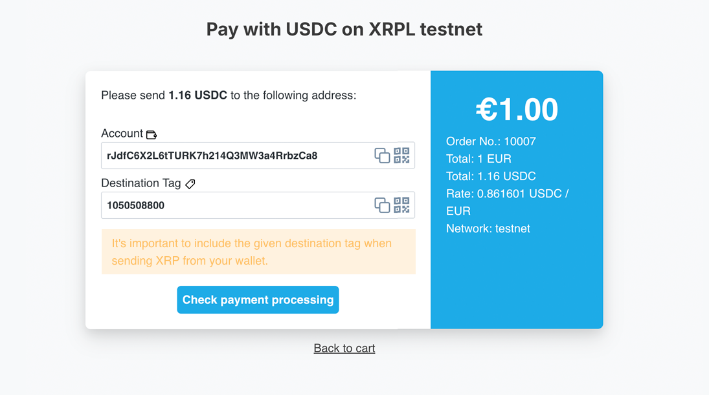

# LedgerDirect Payment plugin for Shopware

[](https://github.com/ledger-direct/ledger-direct-shopware6/actions/workflows/ci.yml)


[](LICENSE)

LedgerDirect is a payment plugin for Shopware. Receive crypto and stablecoin payments directly – without middlemen,
intermediary wallets, extra servers or external payment providers. Maximum control, minimal detours!

Project Website: https://www.ledger-direct.com

GitHub: https://github.com/ledger-direct/ledger-direct-shopware6



## Requirements
- Shopware 6.6.5 or 6.7
- PHP 8.2 or higher
- [`hardcastle/ledger-direct-core`](https://packagist.org/packages/hardcastle/ledger-direct-core) — the
  platform-agnostic XRPL and pricing logic shared by all LedgerDirect plugins. Shopware installs it automatically
  along with the plugin.

## Installation

### Manual Installation

1. Installation via git/CLI: In `custom/plugins`, use execute`git clone https://github.com/ledger-direct/ledger-direct-shopware6.git LedgerDirect`.
2. Manually: Downloading the .zip archive of this plugin (`Code -> Download ZIP`) and extract its contents into `custom/plugins/LedgerDirect`.
3. Refresh Shopware plugin list: `bin/console plugin:refresh`
4. Install and activate the plugin: `bin/console plugin:install LedgerDirect --activate`
5. Clear the cache: `bin/console cache:clear`

Installing the plugin also installs its dependency `hardcastle/ledger-direct-core` from Packagist, so the shop needs
composer to be able to reach the network during step 4.

### Configuration
1. Configure the basic settings like receiving wallet address in the Shopware admin under "Settings" > "Extensions" > "My Extensions" > "LedgerDirect".
2. Enable LedgerDirect XRP / RLUSD / USDC payment methods in "Settings" > "Shop" > "Payment Methods".
3. Set the LedgerDirect payment methods as available for your sales channels.

## Available currencies:
- XRP (XRP Ledger)
- RLUSD (XRP Ledger)
- USDC (XRP Ledger)

To receive stablecoin payments, ensure you have the corresponding currencies (RLUSD, USDC etc.) enabled in the plugin settings.
The merchant wallet address needs to have the corresponding trust lines set up for the stablecoins you want to accept.

## Test Payments
To test the plugin, you can configure it to use the XRP Ledger Testnet. This allows you to simulate transactions without using real funds. Follow these steps:
1. Go to the extension settings in Shopware admin ("Settings" > "Extensions" > "My Extensions" > "LedgerDirect").
2. Enable the Testnet mode.
3. Use a test XRP Ledger account to make test payments.
4. You can create test accounts from https://xrpl.org/xrp-testnet-faucet.html for XRP or https://tryrlusd.com/ for RLUSD.

## Payment page

After the checkout the customer is sent to the LedgerDirect payment page: the amount to send, large and with a copy
button; the receiving address; the destination tag, marked as required; for tokens the issuer; one QR code with
address and tag (the amount joins once the wallet scan test is done); a countdown for the quoted amount; and, on a
desktop, the browser wallets XRPL Connect detects (Crossmark, GemWallet, MetaMask Snap, Ledger, Otsu, Xyra; Xaman and
WalletConnect once their public identifier is configured). The page is reachable by the order's link code (the same
one Shopware uses for guest order links), so guest orders work and the link keeps working without a login.

The page shows one of five states and polls the shop every eight seconds:

| State | Meaning |
|---|---|
| waiting | Nothing has arrived and the quoted amount is still valid — a countdown shows for how long |
| expired | Nothing has arrived and the quote has passed — a button fetches an updated amount, account and tag stay the same |
| partial | Something arrived in the quoted asset, but not enough — the outstanding amount becomes the main amount; a second payment adds up |
| wrong_asset | Something arrived, but in another token or from another issuer — nothing is credited, the full amount is still due |
| settled | Paid — a confirmation, then the customer is sent on to the order |

**Configuration card "Payment page":** the logo (the shop's theme logo, a picture from the media library, or a
monogram of the shop name), one accent colour for buttons and highlights (a colour too light for white text falls
back to the default), and the optional Xaman API key and WalletConnect project ID — public browser identifiers,
which you should restrict to your shop domain in the respective dashboard.

The transaction state in the administration follows the ledger: `Paid partially` as soon as something arrives that
does not settle the order, `Paid` as soon as it does — whether or not the customer is still looking at the page.

The status endpoint (`/store-api/ledger-direct/payment/check/{orderId}?deepLinkCode=…`) returns the same payload as
every other LedgerDirect plugin, plus a `redirect` URL once the order no longer waits for payment. The ledger is
synced at most once every five seconds per receiving account.

The page's behaviour and design live in `src/Resources/app/storefront/src/payment-ui/`, free of any Shopware
import, with the markup contract in its README — the same files will serve the other LedgerDirect plugins.

## External Services
LedgerDirect uses public APIs from Coingecko, Binance, and Kraken to retrieve current cryptocurrency exchange rates. These rates are needed to correctly calculate and display payments.

No personal or payment data is sent to these services. Only requests for current rates are made when a payment is processed or displayed.

For more information about each service, see:
- Coingecko API: [Terms of Service](https://www.coingecko.com/en/terms), [Privacy Policy](https://www.coingecko.com/en/privacy)
- Binance API: [Terms of Use](https://www.binance.com/en/terms), [Privacy Policy](https://www.binance.com/en/privacy)
- Kraken API: [Terms of Service](https://www.kraken.com/legal), [Privacy Policy](https://www.kraken.com/privacy)

## Development

The core library is developed alongside the plugins. To work against a local core checkout instead of the released
version, add a path repository to the *shop's* `composer.json` and require the branch:

```
composer config repositories.ledger-direct-core path ../LedgerDirectCorePHP/ledger-direct-core-php
composer require hardcastle/ledger-direct-core:dev-master
```

Keep the plugin's own constraint on the released version; the shop-level override is a local concern.

### A cache that survives the request

The payment-status endpoint throttles ledger syncs per receiving account through `cache.object`, and
the core caches exchange rates in the same pool. Shopware's own `dev` configuration backs that pool
with the in-memory array adapter, so in a dev shop both are silently void: every poll is a node
request. Set `framework.cache.app` to `cache.adapter.filesystem` (or Redis) in
`config/packages/dev/` when you test the payment page in `APP_ENV=dev`. Production configurations
are unaffected. Each actual sync is logged at debug level as `LedgerDirect: ledger synced`, which
is how you see whether the throttle holds.

## License
The MIT License (MIT). Please see [License File](LICENSE) for more information.
