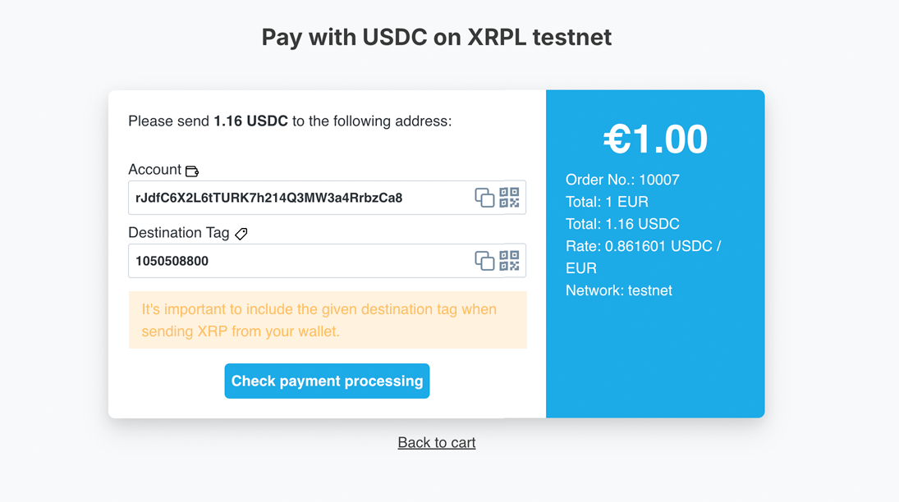

# LedgerDirect for Shopware 6

[](https://github.com/ledger-direct/ledger-direct-shopware6/actions/workflows/ci.yml)


[](LICENSE.md)

Accept XRP, RLUSD and USDC directly on the XRP Ledger — no payment processor, no custody, funds
land in the merchant's own wallet.

The plugin is the Shopware 6 adapter over
[`hardcastle/ledger-direct-core`](https://packagist.org/packages/hardcastle/ledger-direct-core), the
shared package that holds the XRPL and pricing logic. Everything platform-specific — the payment
handlers, order transaction states, the payment page, the settings cards, the scheduled task — lives
here; price conversion, the oracle set, the stablecoin registry and ledger sync live in the core and
are not reimplemented.

Project website: https://www.ledger-direct.com



## How it works

A customer picks XRP, RLUSD or USDC at checkout; each is a payment method of its own. The order is
placed straight away with its transaction **Open** and the customer gets a payment page: the exact
amount, the shop's receiving address, and a **destination tag** unique to that order. The tag is what
ties an incoming ledger transaction back to the order, so one wallet address serves every customer.

The quote is fixed for a configurable window (five minutes by default). Reloading the page never
changes the amount; once the quote lapses the customer can ask for an updated one, and the
destination tag stays the same so a payment already in flight is not orphaned.

Payments are confirmed three ways, which is deliberate redundancy:

- the payment page polls while the customer is watching,
- a **check now** button for anyone who would rather not wait (and for browsers without JavaScript),
- a scheduled task that settles orders for customers who closed the page.

An order is credited only from the ledger's `delivered_amount`, only when what arrived covers the
requested amount, and — for stablecoins — only when the currency and issuer match. Several payments
in the quoted asset add up, so a customer who sent too little can send the rest. Anything else stays
open, and the payment page says why: it shows one of five states — waiting, expired, partial payment
(with the outstanding amount), wrong token (with the full amount still due), or paid — and updates
in place while the customer watches, without reloading.

The transaction state in the administration follows the ledger. **Paid** once the order is settled,
whether or not the customer is still looking at the page. **Paid partially** as soon as something
arrives that does not settle the order — also for a payment in another token or from another issuer,
where nothing is credited but money is there and Shopware has no closer state. The numbers behind
that state are on the **LedgerDirect card** of the order detail (tab *Details*, under the transaction
card): the payment's state in the core's five words, what was quoted (asset, amount, rate, receiving
account, destination tag, issuer for a token, quote validity), what arrived — naming the other token
and its issuer when it was the wrong one —, what is still due, and the transaction as a link to the
XRPL explorer. The card is read-only and computed on the server; it is the same payload the payment
page polls. A transaction the merchant closed by hand (cancelled, failed, refunded) is never reopened
by a late payment.

The page asks the server every 8 seconds. That endpoint syncs with the XRPL node at most once every
5 seconds per receiving account, whatever the number of customers waiting; in between it answers
from what is already stored. A guest order can poll too — the link carries the order's deep link
code, the same one Shopware uses for its guest order links, and no login is required.

## Requirements

- Shopware 6.6.5 or newer, or 6.7
- PHP 8.2 or newer
- An XRP Ledger account. Accepting RLUSD or USDC additionally requires a **trustline** to the
  respective issuer on that account, or payments will fail on the ledger.

## Installation

Upload the release zip in the administration (Extensions → My extensions → Upload extension), or
clone this repository into `custom/plugins/LedgerDirect` and run:

```
bin/console plugin:refresh
bin/console plugin:install LedgerDirect --activate
bin/console cache:clear
```

Installing also installs the core from Packagist into the shop — the plugin asks Shopware to run
Composer for it (`executeComposerCommands()`), because Shopware never loads a vendor directory
shipped inside a plugin — so the shop needs to reach the network during that step.

Installing creates the three payment methods and two tables for ledger data (synced transactions
and the destination-tag counter); activating the plugin switches the payment methods on, assigning
them to sales channels is still yours to do (see Configuration). Uninstalling deactivates the payment methods and
deliberately **keeps** the tables: the destination-tag counter cannot be reconstructed, and reusing
tags would match new orders against old payments.

Updates run the plugin's migrations through Shopware's usual `plugin:update`.

## Configuration

Settings → Extensions → My extensions → LedgerDirect → Configure. Two cards.

**LedgerDirect – XRPL settings**

| Setting | |
|---|---|
| Use testnet | On by default. The receiving address must belong to the selected network. |
| Merchant wallet address, mainnet and testnet | The shop's receiving account on each network; the one for the selected network is used. |
| Enable RLUSD payments, Enable USDC payments | Whether the stablecoin payment methods can be used; the receiving account needs the trustline first. |
| Quote validity in seconds | How long a quoted amount stays fixed. Default 300. |

**LedgerDirect – Payment page**

| Setting | |
|---|---|
| Logo | What the payment page shows in its header: the theme's shop logo, a picture from the media library, or the first letter of the shop name. |
| Accent colour | The one colour of the payment page — buttons, countdown bar, destination tag — with white text on it, so it must be dark enough (contrast 4.5:1). Default `#1f5eff`; a lighter colour falls back to the default. |
| Xaman API key, WalletConnect project id | Public identifiers, optional. With one of them, customers on a phone get an "Open in wallet app" button. Restrict them to your shop domain in the respective dashboard. |

Issuer addresses are not configurable. They are fixed in the core: a wrong issuer would send
customer funds to a dead trustline.

Then assign the payment methods to the sales channels that should offer them, under Settings →
Shop → Payment methods (and switch them on there if the plugin was installed without `--activate`).

The scheduled task `ledger_direct.settle_open_transactions` runs every five minutes on Shopware's
message queue, so a worker (`messenger:consume` or the admin worker) has to be running. Without it,
a customer who closes the payment page before their transaction confirms is only settled the next
time someone visits their payment page.

## Test payments

Leave *Use testnet* on and enter a testnet account as the testnet wallet address. Test accounts
come from the [XRP Testnet faucet](https://xrpl.org/xrp-testnet-faucet.html) for XRP, the
[RLUSD faucet](https://tryrlusd.com/) for RLUSD and the [Circle faucet](https://faucet.circle.com/)
for USDC; the receiving account needs the trustlines, the paying wallet needs the tokens.

## The payment page

After checkout the customer lands on `/ledger-direct/payment/{orderId}?deepLinkCode=…`, a storefront
page that keeps the theme's `<head>` and stylesheets but replaces the body: no header, navigation or
footer. The same controller answers the "check now"
button and the quote refresh; the page polls
`/store-api/ledger-direct/payment/check/{orderId}?deepLinkCode=…`, which returns the same payload as
every other LedgerDirect plugin (`INVARIANTS.md` in the core, "Payment status"), plus a `redirect`
URL once the order no longer waits for payment.

Behaviour and design come from [`@ledger-direct/payment-ui`](https://github.com/ledger-direct/ledger-direct-payment-ui),
the package every LedgerDirect plugin shares: the five payment states, the countdown, polling,
copy buttons, the QR code with address, destination tag and amount, and browser wallets over
XRPL Connect (Crossmark, GemWallet, MetaMask Snap, Ledger, Otsu, Xyra; Xaman and WalletConnect
with the identifiers above). `src/Resources/app/storefront/src/package.json` pins the package's
tag; `main.js` is the Shopware hull that registers the page as a storefront plugin, and the
template renders the package's markup contract (`src/README.md` there). Every sentence a customer
reads is in the template and the snippet files; nothing is rounded or reformatted in the browser.

The package's stylesheet is committed as `scss/payment-page.css` next to the plugin's SCSS: Shopware
compiles a plugin's SCSS on the server, in the merchant's shop, where `node_modules` does not exist.
To move to a new package version: change the tag in `package.json`, run `npm install` and
`npm run sync` in that directory, rebuild the storefront with Shopware's `bin/build-storefront.sh`
(after `bundle:dump`, or the plugin bundle is silently skipped) and commit
`src/Resources/app/storefront/dist/` together with the stylesheet copy. A unit test compares the
copy with the installed package.

Without JavaScript the page still works: the amount, address and tag are server-rendered, the QR
code is drawn on the server from the same payment request, and the "Check payment now" button is a
plain form.

## External services

Exchange rates come from the public APIs of Coingecko, Binance and Kraken, through the core. No
personal or payment data is sent to them; only the current rate is requested when a payment is
quoted or displayed, and rates are cached in the shop's object cache so a short outage of one
source does not interrupt checkout.

- Coingecko API: [Terms of Service](https://www.coingecko.com/en/terms), [Privacy Policy](https://www.coingecko.com/en/privacy)
- Binance API: [Terms of Use](https://www.binance.com/en/terms), [Privacy Policy](https://www.binance.com/en/privacy)
- Kraken API: [Terms of Service](https://www.kraken.com/legal), [Privacy Policy](https://www.kraken.com/privacy)

## Development

How the whole of LedgerDirect is tested across the core, the shared page package and the four
plugins — the layers, what each catches, the nightly end-to-end runs and the manual cases — is in
[`docs/testing.md` of the core](https://github.com/ledger-direct/ledger-direct-core-php/blob/master/docs/testing.md).
The manual cases for this plugin, by the core's case IDs, are in `tests/Manual/payment-status.md`.

The plugin is developed inside a Shopware installation (a dockware container in CI and locally);
the tests run with the shop's PHPUnit, from the plugin directory:

```
/var/www/html/vendor/bin/phpunit --testsuite Unit
/var/www/html/vendor/bin/phpunit --testsuite Integration
make phpstan
```

The unit suite builds the real core services and stubs only the edges the platform provides (a
PSR-18 client, the port implementations); the integration suite needs the booted shop and its
database and is offline by design. After a version bump in `composer.json`, run
`APP_ENV=test bin/console plugin:refresh` as well: the test environment has its own plugin registry.

To work against a local core checkout instead of the released version, add a path repository to the
*shop's* `composer.json` and require the branch; keep the plugin's own constraint on the released
version:

```
composer config repositories.ledger-direct-core path ../LedgerDirectCorePHP/ledger-direct-core-php
composer require hardcastle/ledger-direct-core:dev-master
```

### A cache that survives the request

The payment-status endpoint throttles ledger syncs per receiving account through `cache.object`, and
the core caches exchange rates in the same pool. Shopware's own `dev` configuration backs that pool
with the in-memory array adapter, so in a dev shop both are silently void: every poll is a node
request. Set `framework.cache.app` to `cache.adapter.filesystem` (or Redis) in
`config/packages/dev/` when you test the payment page in `APP_ENV=dev`. Production configurations
are unaffected. Each actual sync is logged at debug level as `LedgerDirect: ledger synced`, which
is how you see whether the throttle holds.

### Continuous integration and release

Every push and pull request runs `.github/workflows/ci.yml`: `shopware-cli extension validate`
(basic and store-compliance checks as a gate, the full validation non-blocking) and both PHPUnit
suites in a dockware container with Shopware 6.7. `e2e.yml` runs the end-to-end harness against a
fresh dockware shop and the XRPL testnet every night; it is not a merge gate, it detects drift.

The store zip is built with `shopware-cli extension zip`. `.shopware-extension.yml` tells it to ship
the committed storefront bundle as it is rather than building the assets again, and leaves tests,
tooling and this README out. `CHANGELOG_en-GB.md` and `CHANGELOG_de-DE.md` are the changelogs the
store shows.

## Translations

English and German, as snippet files under `src/Resources/snippet/`.

## License

MIT — see [LICENSE.md](LICENSE.md).
